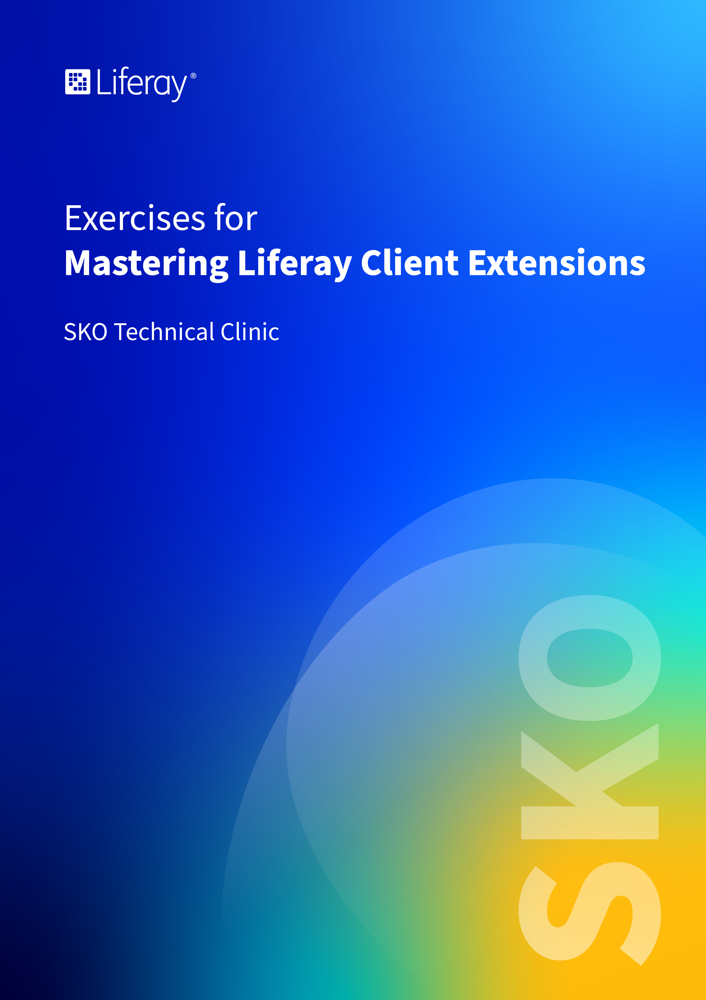
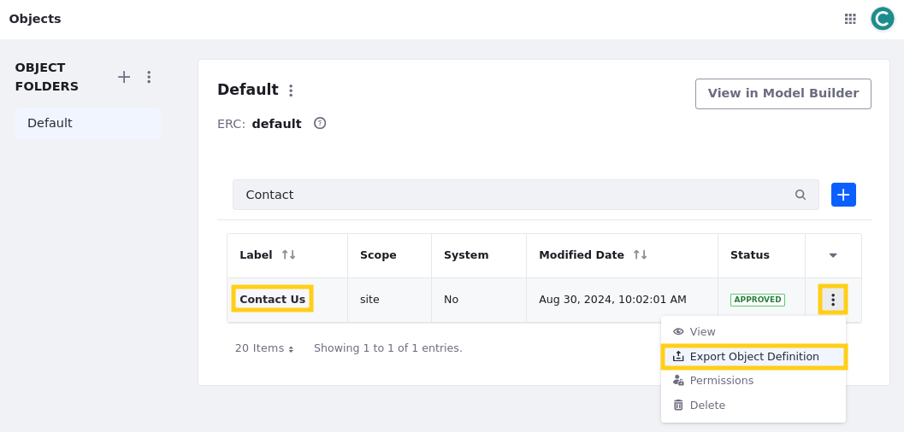
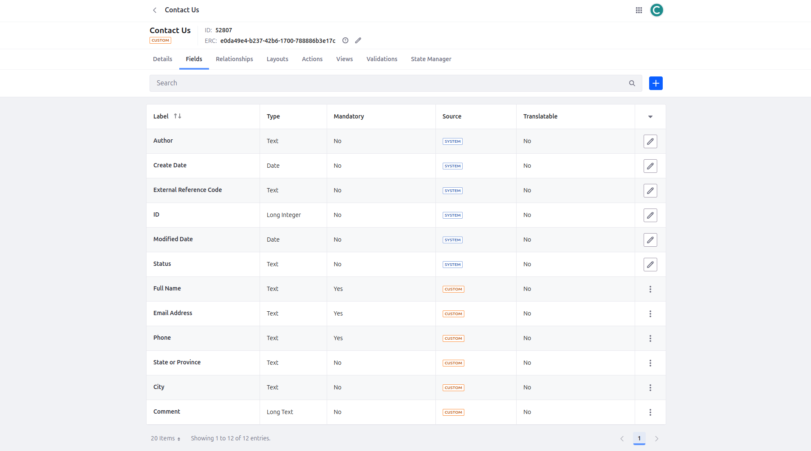
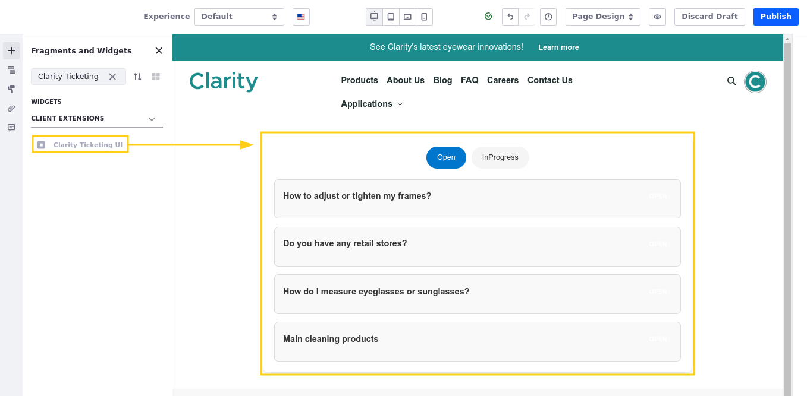
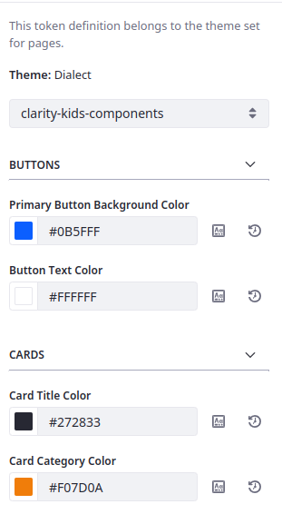
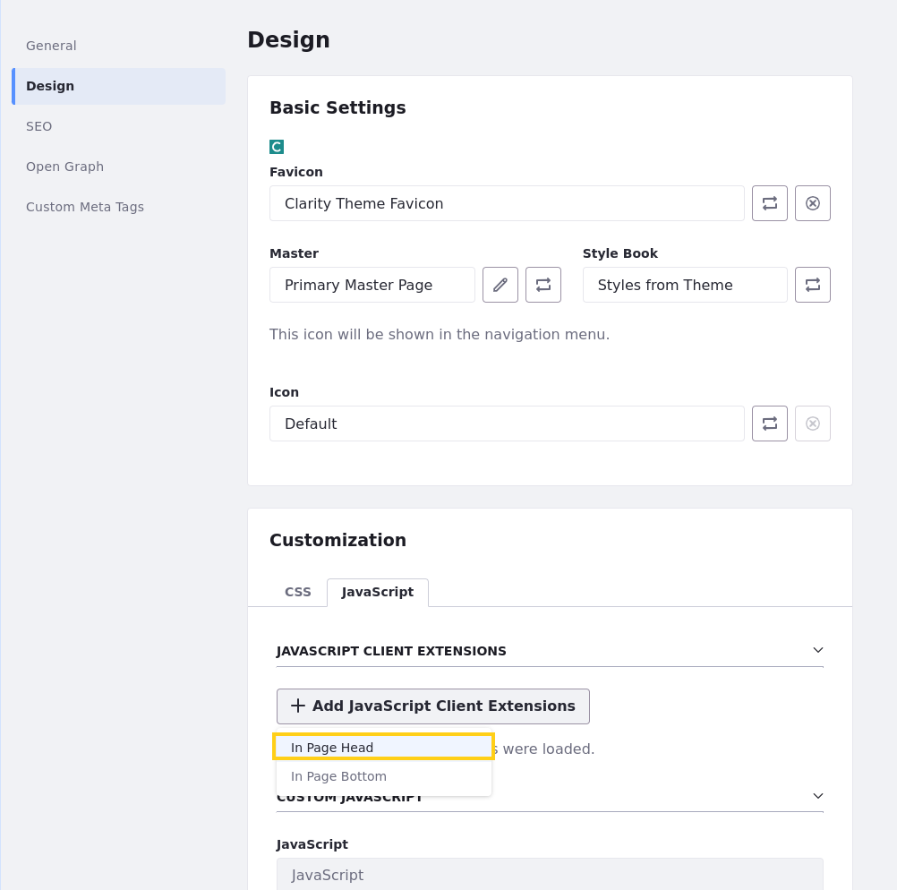
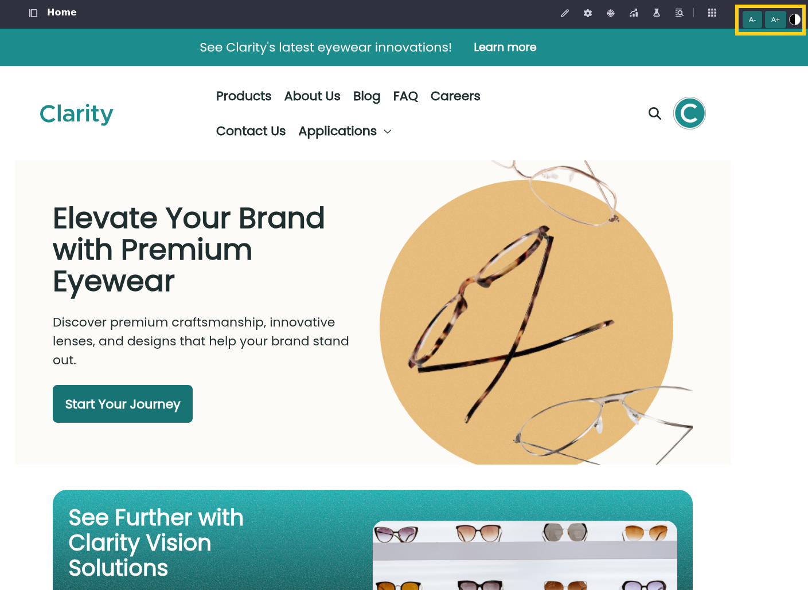

# Exercises for Mastering Liferay Client Extensions - SKO 2025 Edition

## Table of Contents

* [Exercise 1: Setting Up the SKO Workspace](#exercise-1-setting-up-the-sko-workspace)
* [Exercise 2: Exporting the Contact Us Object Definition](#exercise-2-exporting-the-contact-us-object-definition)
* [Exercise 3a: Preparing Clarity's Distributor Management App Payload](#exercise-3a-preparing-claritys-distributor-management-app-payload)
* [Exercise 3b: Configuring the Batch Client Extension](#exercise-3b-configuring-the-batch-client-extension)
* [Exercise 3c: Deploying the Client Extension](#exercise-3c-deploying-the-client-extension)
* [Exercise 4: Deploying Clarity's Ticket List Custom Element](#exercise-4-deploying-claritys-ticket-list-custom-element)
* [Exercise 5: Updating Clarity's Frontend Tokens](#exercise-5-updating-claritys-frontend-tokens)
* [Exercise 6a: Implementing an Accessibility Menu](#exercise-6a-implementing-an-accessibility-menu)
* [Exercise 6b: Applying the Global JS Client Extension to Clarity's Home Page](#exercise-6b-applying-the-global-js-client-extension-to-claritys-home-page)
* [Exercise 7a: Configuring the Microservice Client Extension](#exercise-7a-configuring-the-microservice-client-extension)
* [Exercise 7b: Including Clarity's Business Logic in the Client Extension](#exercise-7b-including-claritys-business-logic-in-the-client-extension)
* [Exercise 7c: Adding and Executing the Account Setup Object Action](#exercise-7c-adding-and-executing-the-account-setup-object-action)

## Exercise 1: Setting Up the SKO Workspace

Throughout the technical clinic, you'll use a local Liferay workspace for the hands-on exercises and practice what you learn. For that purpose, ensure you've completed the SKO Technical Clinic Prerequisites sent via email.

1. Open your terminal and run this command to verify Git is installed:

   ```bash
   git version
   ```

   **Note**: If you're on Windows, use Command Prompt, PowerShell, or BASH to execute terminal commands.

   This returns the version of your git installation. For example,

   ```log
   git version 2.45.2
   ```

   If the Git command isn't found, please see official documentation for how to install Git for your OS ([macOS](https://git-scm.com/download/mac)|[Windows](https://git-scm.com/download/win)|[Linux/Unix](https://git-scm.com/download/linux)).

1. Verify Java JDK 21 is installed:

   ```bash
   java -version
   ```

   The JDK version should display:

   ```log
   openjdk version "21.0.5" 2024-10-15 LTS
   OpenJDK Runtime Environment Zulu21.38+21-CA (build 21.0.5+11-LTS)
   OpenJDK 64-Bit Server VM Zulu21.38+21-CA (build 21.0.5+11-LTS, mixed mode, sharing)
   ```

   If Java isn't installed, you can find the appropriate OpenJDK distribution installer for your OS [here](https://learn.microsoft.com/en-us/java/openjdk/download#openjdk-21). Alternatively, you can download the JDK as a ZIP (Windows) or TAR.GZ (Linux/Mac) package. To install, extract the file in a folder of your choice, then set the JAVA_HOME environment variable to that folder.

   **Note**: If you support multiple Liferay projects and need to switch between different JDK versions, consider using a Version Manager:

      * **Unix-based systems**:
         * [SDKMAN!](https://sdkman.io/)
         * [jEnv](https://www.jenv.be/)
      * **Windows**:
         * [Jabba](https://github.com/shyiko/jabba)
         * [JVMS](https://github.com/ystyle/jvms)

1. (Optional) Verify Blade is installed:

   ```bash
   blade version
   ```

   It should return the CLI's version:

   ```log
   blade version 6.0.0.202404102137
   ```

   If Blade isn't installed, see [Blade CLI](https://learn.liferay.com/w/dxp/liferay-development/tooling/blade-cli) installation instructions.

   If the output indicates there's a newer version, run this command to update it:

   ```log
   blade update
   ```

   **Note**: While we recommend using Blade to set up Liferay Workspace, you can also use Gradle to complete the process manually. See [Creating a Liferay Workspace Manually](https://learn.liferay.com/web/guest/w/dxp/building-applications/tooling/liferay-workspace/creating-a-liferay-workspace#creating-a-liferay-workspace-manually) for more information.

1. In your terminal, go to your desired folder and clone the training workspace to your computer:

   ```bash
   git clone https://github.com/liferay/sko-2025
   ```

   This saves a copy of the project in your current terminal directory.

   **Note**: If you've cloned the repo previously, ensure your workspace is up to date by running `git pull origin main`.

1. Go to the workspace's root folder in your terminal:

   ```bash
   cd sko-2025/
   ```

1. Initialize your Liferay bundle:

   ```bash
   blade server init
   ```

   This downloads and builds dependencies for running Liferay, including the Liferay server.

1. Use Blade to start your Liferay server:

   ```bash
   blade server run
   ```

   Alternatively,

   **Unix-based**:

   ```bash
   ./bundles/tomcat/bin/catalina.sh run
   ```

   **Windows**:
   ```bash
   .\bundles\tomcat\bin\catalina.bat run
   ```

   **Tip**: Wait until you see `org.apache.catalina.startup.Catalina.start Server startup in X milliseconds` to indicate startup completion.

1. When finished, access your Liferay DXP instance by going to `http://localhost:8080/` in your browser.

1. Sign in using these credentials:

   * Username: `admin@clarityvisionsolutions.com`
   * Password: `learn`

1. Take some time to explore the site and resources included in the training workspace.

Great! With your environment set up, you're ready to start contributing to Clarity's solutions!

## Exercise 2: Exporting the Contact Us Object Definition

Here, you'll export Clarity's Contact Us object definition and explore its associated JSON file.

1. In your running Liferay instance, sign in as the Clarity Admin user.

   * Username: `admin@clarityvisionsolutions.com`
   * Password: `learn`

1. Open the *Global Menu* (), go to the *Control Panel* tab, and click *Objects*.

1. Click *Actions* () for the Contact Us object and select *Export Object Definition*.

   

1. Click on the *Contact Us* object and navigate to the *Fields* tab, identifying the currently included fields.

   

1. Open the downloaded `Object_Definition_ContactUs_[...].json` file in a text editor or IDE.

   **Note**: Many text editors and IDEs offer extensions to “prettify” JSON code, improving its readability for human comprehension.

1. Examine the file's JSON elements and nested values.

   This contains the object data used to create a client extension payload, once added to an `items` array block.

Great! By successfully exporting one of Clarity's object definitions and exploring its JSON structure, you've completed the crucial first steps for preparing a batch client extension. Next, you'll learn how to package exported files from Clarity's Distributor Management app into a batch client extension.

## Exercise 3a: Preparing Clarity's Distributor Management App Payload

Here, you'll package the distributor management app's exported resources into a client extension project and create a batch payload from the object definition file.

1. Open a file explorer and navigate to the `exercises/exercise-3/` folder in your course workspace.

1. Rename the `liferay-sample-batch` folder to `clarity-distributor-mgmt-batch`.

   **Note**: The `liferay-sample-batch` client extension was downloaded from the [Liferay Sample Workspace](https://github.com/liferay/liferay-portal/tree/master/workspaces/liferay-sample-workspace). As a best practice, use examples within this workspace as the baseline for your own client extension projects, as this serves as the primary source of truth for client extension implementation.

1. Within the `clarity-distributor-mgmt-batch/batch/` folder, delete the existing `.json` files.

1. From the previous `exercise-3/` folder, move these files into the `clarity-distributor-mgmt-batch/batch/` folder:

   * `00-list-type-definition.batch-engine-data.json`
   * `02-user-role.batch-engine-data.json`
   * `03-workflow-definition.batch-engine-data.json`
   * `Object_Definitions.json`

   These files contain all the resources for Clarity's Distributor Management app: the picklists, user roles, workflow, and the object definitions.

1. Navigate to the `clarity-distributor-mgmt-batch/batch/` folder.

1. Rename the `Object_Definitions.json` file to `01-object-definition.batch-engine-data.json`.

   This puts the object definition batch file in the second deployment position.

   **Note**: It's best practice to include a numeric prefix to each file name to determine the order in which they're imported upon deployment. This is useful when subsequent files require pre-populated dependencies from other files.

1. From the `exercise-3/code-samples/` folder, open the `object-payload-configuration.txt` file and copy its content.

   This file contains the payload configuration block for the object definitions.

1. Open the `clarity-distributor-mgmt-batch/batch/01-object-definition.batch-engine-data.json` file with a text editor or IDE.

1. Paste the code snippet from the `object-payload-configuration.txt` file within the first opening curly brace (`{`), prior to the `items` block:

   This defines the batch payload's configuration and specifies the object definitions as the data block.

1. Your file should resemble this:

   ```json
   {
      "configuration": {
         "className": "com.liferay.object.admin.rest.dto.v1_0.ObjectDefinition",
         "parameters": {
            "containsHeaders": "true",
            "createStrategy": "UPSERT",
            "onErrorFail": "ON_ERROR_FAIL",
            "updateStrategy": "UPDATE"
         },
         "taskItemDelegateName": "DEFAULT"
      },
      "items": [
         {
            "active": true,
            "defaultLanguageId": "en_US",
            "enableCategorization": true,
            "enableIndexSearch": true,
            "enableObjectEntryDraft": true,
            "externalReferenceCode": "D4B8_DISTRIBUTOR_APPLICATION",
            [...]
            "titleObjectFieldName": "creator"
         }
      ]
   }
   ```

   **Note**: Ensure the object definitions are under the `items` block as a valid JSON before proceeding.

1. Save the file.

Great! You've moved the distributor management app's resources into a client extension project and created a batch payload from the object definition file. Next, you'll define the `client-extension.yaml` file.

## Exercise 3b: Configuring the Batch Client Extension

Here, you'll define the structure, resources, and configurations needed to deploy and manage the batch client extension.

1. Within the `clarity-distributor-mgmt-batch/` project folder, open the `client-extension.yaml` with a text editor or IDE.

1. Delete the file's existent content.

1. From the `exercise-3/code-samples/` folder, open the `client-extension-assemble-block.txt` file and copy its content.

1. Paste the code snippet in the `client-extension.yaml` file you opened previously.

   This adds the `assemble` block to specify which resources the client extension should package during the build process.

1. Open the `client-extension-definition-block.txt` file in the `code-samples/` folder, copy the code snippet, and paste it in the `client-extension.yaml` file under the `assemble` block.

   This adds the batch client extension definition for Clarity's distributor management app, including its name, the OAuth 2.0 server reference, and type.

1. Open the `client-extension-server-block.txt` file in the `code-samples/` folder, copy the code snippet, and paste it in the `client-extension.yaml` file under the client extension definition block.

   This adds an OAuth 2.0 headless server client extension for authorizing API calls with the necessary scopes for the batch client extension.

   **Note**: To find the correct API scopes for your batch client extension, go into your Liferay instance's UI, open the *Global Menu* (), go to the *Control Panel* tab, and click *OAuth 2 Administration*. Select an OAuth 2.0 application from the list and go to the *Scopes* tab. This section displays all available Liferay API scopes.

1. Your file should resemble this:

   ```yaml
   assemble:
      - from: batch
        into: batch
   clarity-distributor-mgmt-batch:
      name: Clarity Distributor Management Batch
      oAuthApplicationHeadlessServer: clarity-distributor-mgmt-batch-oauth-application-headless-server
      type: batch
   clarity-distributor-mgmt-batch-oauth-application-headless-server:
      .serviceAddress: localhost:8080
      .serviceScheme: http
      name: Clarity Distributor Management Batch OAuth Application Headless Server
      scopes:
         - Liferay.Headless.Admin.List.Type.everything
         - Liferay.Headless.Admin.User.everything
         - Liferay.Headless.Admin.Workflow.everything
         - Liferay.Headless.Batch.Engine.everything
         - Liferay.Object.Admin.REST.everything
      type: oAuthApplicationHeadlessServer
   ```

1. Save the file.

   With the client extension set up, you can now move it to the appropriate workspace location.

1. Move the `clarity-distributor-mgmt-batch/` project folder into the `client-extensions/` folder of your course workspace.

   **Note**: Copying and pasting the project will result in a deployment failure due to the duplicate client extension folders. To prevent this, move the project to the `client-extensions/` folder.

Great! You've fully configured Clarity's distributor management batch client extension. Next, you'll deploy it into your Liferay environment.

## Exercise 3c: Deploying the Client Extension

Here, you'll deploy the batch client extension to add the distributor management app into your Liferay instance.

1. Open a terminal and navigate to the `client-extensions/clarity-distributor-mgmt-batch/` in your course workspace.

1. Run this command to build and deploy the client extension:

   ```bash
   blade gw clean deploy
   ```

   In your Liferay logs, you'll find various messages related to import tasks executed by the `BatchEngineImportTaskExecutorImpl` module. These import tasks correspond to the files within the `batch/` folder.

1. Open your instance logs and search for a message similar to this:

   ```log
   INFO  [fileinstall-directory-watcher][BatchEngineImportTaskExecutorImpl:94] Started batch engine import task 904
   ```

   This informs you that the batch engine has started an import task with the assigned ID `904`.

1. Search for another message similar to this:

   ```log
   INFO  [fileinstall-directory-watcher][BatchEngineImportTaskExecutorImpl:175] Finished batch engine import task 904 in 48ms
   ```

   This indicates that the import task with the ID `904` has finished.

   **Note**: You can use the import task ID (e.g., `904`) to retrieve information from the batch API for troubleshooting errors and unexpected behaviors. Explore this in more detail in the Mastering Liferay's Headless APIs (*Coming Soon*) course.

1. Verify it deploys successfully.

   ```log
   INFO [fileinstall-directory-watcher][BundleStartStopLogger:68] STARTED claritydistributormgmtbatch_7.4.13 [1462]
   ```

   Now that you've deployed the batch client extension, you can examine the distributor management app.

1. In your Liferay instance, sign in as the Clarity Admin user.

   * Username: `admin@clarityvisionsolutions.com`
   * Password: `learn`

1. Open the *Global Menu* (), go to the *Control Panel* tab, and click *Objects*.

1. Verify these objects are present:

   * Distributor Application
   * Application Evaluation

1. In the Global Menu (), go to the *Control Panel* tab and click *Picklists*.

1. Verify these picklists are present:

   * Annual Purchase Volumes
   * Application States
   * Assessment Scores
   * Decisions
   * Distribution Channels
   * Distribution Regions
   * Product Types
   * Recommendations

1. In the Global Menu (), go to the *Control Panel* tab and click *Roles*.

1. Verify these user roles are present:

   * Business Development Manager
   * Business Development Specialist

1. In the Global Menu (), go to the *Applications* tab and click *Process Builder*.

1. Verify the Distributor Manager Approval workflow is present.

Great! You've deployed the batch client extension and explored the distributor management app's content. Next, you'll deploy a user interface for Clarity's Ticketing app.

## Exercise 4: Deploying Clarity's Ticket List Custom Element

Here, you'll explore and deploy a React application developed by Clarity's team as a Custom Element client extension, designed to retrieve, filter, and display ticket data.

1. Open a file explorer and navigate to the `exercises/exercise-4/` folder in your course workspace.

1. Rename the `react-app/` folder to `clarity-ticketing-ui`.

   This is our application folder, which we will transform into a client extension.

1. Go to the `exercises/exercise-4/code-samples` folder in your course workspace, open the `webpack.config.js` file, and copy its content.

1. Paste the copied content into the `clarity-ticketing-ui/webpack.config.js` file.

   Note that we've added the `library` format, which specifies how the output bundle should be exposed.

1. Save the file.

1. From the `clarity-ticketing-ui/public` folder, open the `index.html` file in a text editor or IDE.

1. Replace the `<root>` and the `<tickets-root>` tags with a `<clarity-ticketing-ui>` tag, the name of our custom element.

   Go to the `exercises/exercise-4/code-samples/index.html` to see the correct implementation.

1. Save the file.

1. Go to the `exercises/exercise-4/code-samples/` folder in your course workspace, open the `index.js` file, and copy its content.

1. Paste the copied content into the `clarity-ticketing-ui/index.js` file.

   This replaces the default use of `render()` on the `ticket-root` div, leveraging a Web Component to define the React app as a reusable and self-contained custom element.

1. Save the file.

1. From the `exercises/exercise-4/code-samples/` folder in your course workspace, move the `client-extension.yaml` file to the `clarity-ticketing-ui/` folder.

1. Move the `clarity-ticketing-ui/` folder into the client-extensions/ folder of your course workspace.

1. Open a terminal and navigate to the `client-extensions/clarity-ticketing-ui/` folder.

1. Run this command to build and deploy the custom element client extension:

   ```bash
   blade gw clean deploy
   ```

1. Verify that the client extension deploys successfully:

   ```log
   2025-01-28 11:50:59.076 INFO  [fileinstall-directory-watcher][BundleStartStopLogger:68] STARTED clarityticketingui_7.4.13 [1462]
   ```

   Now that you've deployed the custom element client extension, you can examine the Ticketing app UI.

1. In your Liferay instance, sign in as the Clarity Admin user.

   * Username: `admin@clarityvisionsolutions.com`
   * Password: `learn`

1. Open the *Site Menu* (), click *Page Tree*, and select the *Tickets* page.

1. Click *Edit* () to start editing the page.

1. In the Fragments and Widgets search bar, search for `Clarity Ticketing UI`.

1. Drag and drop the *Clarity Ticketing UI* widget to the page.

   

1. Click *Publish*.

Great! You've successfully deployed a custom element client extension for retrieving and displaying Clarity's ticket data. Next, you'll modify Clarity's current theme CSS client extension.

## Exercise 5: Updating Clarity's Frontend Tokens

Here, you'll add a new frontend token definition to Clarity's current Theme CSS client extension. You'll also import a new font family to override the current one.

1. Open a file explorer and navigate to the `exercises/exercise-5/` folder in your course workspace.

1. Open the `frontend-token-definition.json` file and examine its contents.

1. Move the `frontend-token-definition.json` file to the `client-extensions/clarity-theme/src/` folder in your course workspace.

1. From the `clarity-theme/` folder, open the `client-extension.yaml` file in a text editor or IDE.

1. Add this line above the `name` property under the `clarity-theme` definition block:

   ```yaml
   frontendTokenDefinitionJSON: src/frontend-token-definition.json
   ```

   For example,

   ```yaml
   assemble:
      - from: build/buildTheme/img
         into: static/img
      - from: assets
         into: static
   clarity-theme:
      clayURL: css/clay.css
      mainURL: css/main.css
      frontendTokenDefinitionJSON: src/frontend-token-definition.json
      name: Clarity Theme CSS
      type: themeCSS
   ```

1. From the `client-extensions/clarity-theme/src/css/dialect/variables/` folder, open the `_color_scheme.scss` file and update the following variables by replacing their values with the following frontend token definition variables.

   ```scss
   --color-action-primary-default: var(--btn-primary-bg),
	--color-action-primary-hover: var(--btn-primary-bg),
	--color-action-primary-inverted: var(--btn-primary-color),
	--color-brand-primary: var(--card-category-color),
	--color-neutral-10: var(--card-title-color),
   ```

   This change maps the theme's variables to the corresponding tokens in the `frontend-token-definitions.json` file.

1. From the `client-extensions/clarity-theme/src/css/` folder, open the `_imports.scss` file and append this snippet:

   ```scss
   @import url('https://fonts.googleapis.com/css2?family=Roboto+Slab:wght@100..900&display=swap');
   * {
      font-family: 'Roboto Slab', serif;
   }
   ```

   This imports a font family from an external URL to override the current font.

1. Save your changes.

1. Open a terminal and navigate to the `client-extensions/clarity-theme/` project folder in your course workspace.

1. Run this command to build and deploy the client extension:

   ```bash
   blade gw clean deploy
   ```

1. Verify it deploys successfully.

   ```log
   2025-01-24 14:08:34.676 INFO  [fileinstall-directory-watcher][BundleStartStopLogger:68] STARTED claritytheme_7.4.13 [1463]
   ```

1. In your Liferay instance, open the Site Menu (), expand Design, and click Style Books.

1. Select *Clarity Kids Style Book* to start editing it.

1. In the right side bar's dropdown menu, select *clarity-kids-components*.

1. Verify that the new tokens are available.

1. Modify the colors using the available tokens and observe the real-time changes on your page.

   

1. Return to the Home page and confirm that it stays with the same style.

1. Confirm that the fonts were changed after you deployed the client extension.

Great! You've used the theme CSS client extension to add new frontend tokens to Clarity's style book. The client extension approach enables you to create distinct visual identities for sub-brands quickly and efficiently. Next, you'll learn more about implementing custom functionality with Global JS client extensions.

## Exercise 6a: Implementing an Accessibility Menu

Here, you'll create and deploy an accessibility menu on Clarity's website using a global JS client extension.

1. Open a file explorer and navigate to the `exercises/exercise-6/code-samples/` folder in your course workspace.

1. Open the `01-assemble-block.txt` file with a text editor or IDE, and examine its content.

   ```yaml
   - from: build/static
     into: static
   ```

   This file contains path properties for the `assemble` block in a `client-extension.yaml` file. The block specifies which resources the client extension should package during the build process and their output location.

1. Copy this code snippet.

1. Go to the `client-extensions/clarity-theme/` folder in your course workspace and open the `client-extension.yaml` file.

1. Paste the code from the `01-assemble-block.txt` file at the bottom of the `assemble` block. For example,

   ```yaml
   assemble:
      - from: build/buildTheme/img
        into: static/img
      - from: assets
        into: static
      - from: build/static
        into: static
   clarity-theme:
   [...]
   ```

   **Note**: The order of the properties within the `assemble` block does not affect the configuration. However, ensure that the indentation matches the rest of the content.

1. From the `exercise-6/code-samples/` folder, open the `02-definition-block.txt` file and examine its content.

   ```yaml
   clarity-global-js:
      name: Clarity Global JS
      type: globalJS
      url: global.*.js
   ```

   This file contains the client extension definition block, specifying its name, type, and source URL for the build process.

1. Copy this code snippet.

1. Within the `client-extensions/clarity-theme/client-extension.yaml` file, paste the code after the `clarity-theme-favicon-light` definition block. For example,

   ```yaml
   [...]
   clarity-theme-favicon-light:
      name: Clarity Theme Favicon Light
      type: themeFavicon
      url: clarity-favicon-light.svg
   clarity-global-js:
      name: Clarity Global JS
      type: globalJS
      url: global.*.js
   ```

1. From the `exercise-6/assets/` folder, move the `global.js` file into the `client-extensions/clarity-theme/assets/` folder.

1. Move the `webpack.config.js` file from the `exercise-6/` folder to `client-extensions/clarity-theme/`.

1. Rename the `03-package.json` file from the `exercise-6/` folder to `package.json`.

1. Replace the current `package.json` file in the `client-extensions/clarity-theme/` folder with the file from the previous step.

   **Note**: To avoid duplicate ID errors upon deploying the client extension, move the `package.json` file from the `exercises/exercise-6/` folder rather than copying.

1. Open a terminal and navigate to the `client-extensions/clarity-theme/` folder in your course workspace.

1. Run this command to build and deploy the client extension:

   ```bash
   blade gw clean deploy
   ```
1. Verify it deploys successfully.

   ```log
   2025-01-24 14:08:34.676 INFO  [fileinstall-directory-watcher][BundleStartStopLogger:68] STARTED claritytheme_7.4.13 [1463]
   ```

Now that you've included the global JS client extension in `clarity-theme` and redeployed it, you can add the accessibility menu to Clarity's website.

## Exercise 6b: Applying the Global JS Client Extension to Clarity's Home Page

Here, you'll apply the global JS client extension to Clarity's home page.

1. In your running Liferay instance, click *Edit* () to start editing the Home page.

1. Click *Page Design Options* () on the left menu.

1. Click *More Page Design Options* ().

1. On the Design tab, under the Customization section, click the *JavaScript* tab.

1. Click *Add JavaScript Client Extensions* and select *In Page Head* in the dropdown.

   

1. Select the *Clarity Global JS* checkbox and click *Add*.

1. Scroll to the bottom of the page and click *Save*.

1. Return to the Home page and publish it.

1. Click the *A+* button in the top-right corner of the page to increase the font size.

   

Great! Now you can control the page's font size and apply a grayscale filter. Next, you'll implement a microservice client extension to offload account creation for Clarity's approved distributor applications.

## Exercise 7a: Configuring the Microservice Client Extension

Here, you'll set up the structure for Clarity's microservice client extension handling distributor management actions.

1. Open a file explorer and navigate to the `client-extensions/` folder in your course workspace.

1. Create a new folder named `clarity-distributor-mgmt-action`.

   You'll use this folder to consolidate the microservice actions for Clarity's distributor management app.

   **Note**: It's considered best practice to group all the components for a specific application within a single client extension project.

1. From the `exercises/exercise-7/liferay-sample-etc-spring-boot/` folder, move these files to the `clarity-distributor-mgmt-action/` folder:

   * `build.gradle`
   * `Dockerfile`
   * `LCP.json`

   Now that you've included the basic configuration files for a client extension project leveraging Spring Boot, you can create the `client-extension.yaml` file.

1. Within the `clarity-distributor-mgmt-action/` folder, create a new file named `client-extension.yaml`.

1. Open the file with a text editor or IDE.

1. From the `exercise-7/code-samples/` folder, open the `01-assemble-block.txt` file and examine its content.

   ```yaml
   assemble:
      - fromTask: bootJar
   ```

   This `assemble` block configures the build process to trigger the `bootJar` task and include its output (a `.jar` file) in the resulting LUFFA.

1. Copy this code snippet and paste it in the `client-extension.yaml` file.

1. From the `exercise-7/code-samples/` folder, open the `02-oauth-definition-block.txt` file and examine its content.

   ```yaml
   clarity-distributor-mgmt-action-oauth-application-user-agent:
      .serviceAddress: localhost:58081
      .serviceScheme: http
      name: Clarity Distributor Mgmt Action OAuth Application User Agent
      scopes:
         - Liferay.Headless.Admin.User.everything
      type: oAuthApplicationUserAgent
   ```

   This definition block configures an OAuth headless user agent configuration client extension, specifying its name and required scope. This secures communication between the microservice and Liferay DXP.

   **Note**: Including the `Liferay.Headless.Admin.User.everything` scope is crucial for the client extension to create new accounts for approved distributor users.

1. Copy this code snippet and paste it in the `client-extension.yaml` file under the `assemble` block.

1. From the `exercise-7/code-samples/` folder, open the `03-object-action-definition-block.txt` file and examine its content.

   ```yaml
   clarity-distributor-mgmt-action-object-action-account:
      name: Clarity Distributor Mgmt Action Account
      oAuth2ApplicationExternalReferenceCode: clarity-distributor-mgmt-action-oauth-application-user-agent
      resourcePath: /distributor/mgmt/create-account
      type: objectAction
   ```

1. Copy this code snippet and paste it in the `client-extension.yaml` file under the OAuth application definition block.

1. Your file should resemble this:

   ```yaml
   assemble:
      - fromTask: bootJar
   clarity-distributor-mgmt-action-oauth-application-user-agent:
      .serviceAddress: localhost:58081
      .serviceScheme: http
      name: Clarity Distributor Mgmt Action OAuth Application User Agent
      scopes:
         - Liferay.Headless.Admin.User.everything
      type: oAuthApplicationUserAgent
   clarity-distributor-mgmt-action-object-action-account:
      name: Clarity Distributor Mgmt Action Account
      oAuth2ApplicationExternalReferenceCode: clarity-distributor-mgmt-action-oauth-application-user-agent
      resourcePath: /distributor/mgmt/create-account
      type: objectAction
   ```

1. Save the file.

Great! Now that you've configured the microservice client extension, you'll include the source code for the distributor management app's business logic.

## Exercise 7b: Including Clarity's Business Logic in the Client Extension

Here, you'll start creating the source code that includes the business logic for Clarity's distributor management app.

1. Within the `client-extensions/clarity-distributor-mgmt-action/` folder of the course workspace, create these three folders:

   * `src/`
   * `src/main/`
   * `src/main/resources/`

1. From the `exercises/exercise-7/liferay-sample-etc-spring-boot/src/main/resources/` folder, move these files into the `clarity-distributor-mgmt-action/src/main/resources/` folder:

   * `application.properties`
   * `application-default.properties`

1. Open the `application.properties` file with a text editor or IDE, and examine its contents.

   For this client extension, you'll leverage the `spring.config.import` property to add additional property files and mark specific files as optional.

1. Open the `application-default.properties` file, and examine its contents.

   **Note**: The current content of this file is from the Liferay Sample Workspace. Next, you'll need to update the `liferay.oauth.application.external.reference.codes` property with the client extension's OAuth 2.0 application reference.

1. For the `liferay.oauth.application.external.reference.codes` property, delete the existing reference codes.

1. Configure the property with the value `clarity-distributor-mgmt-action-oauth-application-user-agent`.

   Your file should resemble this:

   ```
   [...]
   #
   # OAuth
   #

   liferay.oauth.application.external.reference.codes=clarity-distributor-mgmt-action-oauth-application-user-agent

   liferay.oauth.urls.excludes=/ready
   [...]
   ```

1. Save the file.

1. In `clarity-distributor-mgmt-action/src/main/`, create these folders for the Java source files:

   * `java/`
   * `java/com/`
   * `java/com/clarityvisionsolutions/`
   * `java/com/clarityvisionsolutions/distributor/`
   * `java/com/clarityvisionsolutions/distributor/actions/`

1. Navigate to the `clarity-distributor-mgmt-action/src/main/java/com/clarityvisionsolutions/distributor/actions/` folder and create three new files:

   * `DistributorMgmtSpringBootApplication.java`
   * `ReadyRestController.java`
   * `CreateAccountActionRestController.java`

1. Open each file with a text editor or IDE.

1. From the `exercise-7/code-samples/` folder, open the `04-distributor-mgmt-spring-boot-application-class.txt` file and examine its content.

   ```java
   package com.clarityvisionsolutions.distributor.mgmt.actions;

   import com.liferay.client.extension.util.spring.boot.ClientExtensionUtilSpringBootComponentScan;

   import org.springframework.boot.SpringApplication;
   import org.springframework.boot.autoconfigure.SpringBootApplication;
   import org.springframework.context.annotation.Import;

   @Import(ClientExtensionUtilSpringBootComponentScan.class)
   @SpringBootApplication
   public class DistributorMgmtSpringBootApplication {

      public static void main(String[] args) {
         SpringApplication.run(DistributorMgmtSpringBootApplication.class, args);
      }

   }
   ```

   This is a reusable, boilerplate piece of code that annotates the current Java class as a Spring Boot application and imports a Liferay provided class.

1. Copy this code snippet and paste it in the `DistributorMgmtSpringBootApplication.java` file.

1. Save the file.

1. From the `exercise-7/code-samples/` folder, open the `05-ready-rest-controller.txt` file and examine its content.

   ```java
   package com.clarityvisionsolutions.distributor.mgmt.actions;

   import com.liferay.client.extension.util.spring.boot.BaseRestController;

   import org.springframework.web.bind.annotation.GetMapping;
   import org.springframework.web.bind.annotation.RequestMapping;
   import org.springframework.web.bind.annotation.RestController;

   @RequestMapping("/ready")
   @RestController
   public class ReadyRestController extends BaseRestController {

      @GetMapping
      public String get() {
         return "READY";
      }

   }
   ```

   This Java class is a boilerplate Spring Boot controller that checks if a service is running and ready to accept requests.

1. Copy this code snippet and paste it in the `ReadyRestController.java` file.

1. Save the file.

1. From the `exercise-7/code-samples/` folder, open the `06-create-account-action-rest-controller.txt` file and examine its content.

   ```java
   package com.clarityvisionsolutions.distributor.mgmt.actions;

   import com.liferay.client.extension.util.spring.boot.BaseRestController;

   import org.apache.commons.logging.Log;
   import org.apache.commons.logging.LogFactory;

   import org.springframework.beans.factory.annotation.Autowired;
   import org.springframework.http.HttpStatus;
   import org.springframework.http.ResponseEntity;
   import org.springframework.security.core.annotation.AuthenticationPrincipal;
   import org.springframework.security.oauth2.jwt.Jwt;
   import org.springframework.web.bind.annotation.PostMapping;
   import org.springframework.web.bind.annotation.RequestBody;
   import org.springframework.web.bind.annotation.RequestMapping;
   import org.springframework.web.bind.annotation.RestController;

   /**
    * Invoked when a new user account has been created.
   */
   @RequestMapping("/distributor/mgmt/create-account")
   @RestController
   public class CreateAccountActionRestController extends BaseRestController {

      @Autowired
      public CreateAccountActionRestController(
               UserCreatedRequestQueueManager queueManager) {

         _queueManager = queueManager;
      }

      /**
       * Invoked when a new user account has been created.
       *
       * @param jwt the JWT token
       * @param json the user creation request in JSON format
       * @return the response entity
       * @throws Exception if an error occurs
       */
      @PostMapping
      public ResponseEntity<String> post(
               @AuthenticationPrincipal Jwt jwt, @RequestBody String json)
               throws Exception {

         log(jwt, _log, json);

         // Create the request instance

         UserCreatedRequest request = new UserCreatedRequest(json, jwt);

         // Enqueue the request

         _queueManager.enqueue(request);

         // Return a success response

         return new ResponseEntity<>(json, HttpStatus.OK);
      }

      private static final Log _log = LogFactory.getLog(
               CreateAccountActionRestController.class);

      private final UserCreatedRequestQueueManager _queueManager;

   }
   ```

   This script follows an asynchronous approach for handling business logic for objects. It queues the object action's request, handles it in a different thread named `_queueManager`, and sends a response back to Liferay.

   **Note**: By not blocking the initial request and instead handling it asynchronously, you ensure performance is not compromised if the object action's logic is slow.

1. Copy this code snippet and paste it in the `CreateAccountActionRestController.java` file.

1. Save the file.

1. From the `exercises/exercise-7/action-classes/` folder, move these files into the `client-extension/clarity-distributor-mgmt-action/src/main/java/com/clarityvisionsolutions/distributor/actions` folder:

   * `TaskExecutorConfig.java`
   * `UserCreatedRequest.java`
   * `UserCreatedRequestProcessorService.java`
   * `UserCreatedRequestQueueManager.java`

   These files contain the required resources for the object action to perform the asynchronous logic. This code leverages standard Spring Framework classes and libraries that are outside the scope of this course. To learn more, see official [Spring Framework](https://docs.spring.io/spring-framework/reference/) documentation.

   Now that you've fully configured and populated the microservice client extension, you can deploy it to your Liferay instance.

1. Open a terminal and navigate to the `client-extensions/clarity-distributor-mgmt-action/` folder in your course workspace.

1. Run this command to build and deploy the client extension:

   ```bash
   blade gw clean deploy
   ```

1. Verify it deploys successfully.

   ```log
   2025-01-28 03:13:03.580 INFO  [Refresh Thread: Equinox Container: 643102d3-ba4b-4931-9c88-d9859cd1ce41][BundleStartStopLogger:68] STARTED claritydistributormgmtaction_7.4.13 [1473]
   ```

1. Run this command from the `client-extensions/clarity-distributor-mgmt-action/` folder to start the Spring Boot service:

   ```bash
   blade gw bootRun
   ```

1. When the application starts, go to http://localhost:58081/ready. If the application is ready for use, the page displays “READY”.

Great! Now that you've deployed and started the microservice client extension, you can create the object action to trigger the account creation functionality.

## Exercise 7c: Adding and Executing the Account Setup Object Action

Here, you'll add an object action that leverages the microservice client extension you deployed in the previous exercise. Then, you'll create a new distributor application and execute the object action to create a new account.

1. In your Liferay instance, open the *Global Menu* (), go to the *Control Panel* tab, and click *Objects*.

1. Click the *Distributor Application* object.

1. Go to the *Actions* tab and click *Add* ().

1. Enter these values in the Basic Info tab:

   | Field        | Value                                                    |
   |--------------|----------------------------------------------------------|
   | Action Label | `Set Up Account`                                         |
   | Action Name  | `setUpAccount`                                           |
   | Description  | `Create a business account for an approved application.` |
   | Active       | Yes                                                      |

1. Go to the *Action Builder* tab and set these values:

   | Field                   | Value                                                                                  |
   |-------------------------|----------------------------------------------------------------------------------------|
   | Trigger                 | Standalone                                                                             |
   | Action                  | object-action-executor[function#clarity-distributor-mgmt-action-object-action-account] |
   | Error Message > Message | Failed to set up the business account.                                                 |

1. Click Save.

   Now that you've created the Set Up Account object action, you can execute it to automatically create distributor accounts.

1. Open the *Global Menu* (), go to the *Applications* tab, and click *Distributor Applications*.

1. Click *Add* () to start creating a new application.

1. Fill out the fields with these values:

   | Field                   | Value                              |
   |-------------------------|------------------------------------|
   | Applicant Name          | `Richard Howard`                   |
   | Applicant Email Address | `richard.howard@howardsvision.com` |
   | Business Name           | `Howard's Vision`                  |
   | Business Website URL    | `https://www.howardsvision.com`    |
   | Business Phone Number   | `555-867-5309`                     |
   | Business Tax ID Number  | `7618231`                          |
   | Application State       | Open                               |

1. Click *Save*.

1. Go back to the Distributor Applications menu.

1. Click *Actions* () for the entry you created and select *Set Up Account*.

   Once triggered, the object action will call the Spring Boot application and execute the asynchronous logic you implemented earlier.

1. Check the terminal window where you executed the `bootRun` command and see the Spring Boot application's response.

1. Open the *Global Menu* (), go to the *Control Panel* tab, and click *Accounts*.

1. Verify that the Howard's Vision account was created.

1. Go to the *Users* tab and verify the applicant was associated with the account and assigned the Account Administrator role.

Great! You've added custom business logic to Clarity's distributor management app, offloading account creation to a microservice. By leveraging this microservice client extension, Clarity's environment is better equipped to maximize performance when handling complex functionalities.